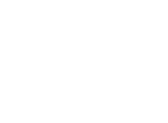

<p align="center">
  
  <br>
  <i>NEVA - AI Personal Resume Assistant</i>
</p>

**NEVA (NEV Virtual Assistant)** is an AI-powered personal assistant designed to represent a candidate professionally. Built with **Spring AI** and **Hexagonal Architecture**, NEVA uses RAG (Retrieval Augmented Generation) to answer questions about the candidate's skills, experience, and background based on their CV and LinkedIn profile.

## 🚀 Key Features

* **Hybrid AI Architecture:** Uses **Google Gemini 1.5 Flash** for chat generation (via OpenAI Adapter) and **Local ONNX Models** for vector embeddings to ensure zero-cost operation on the Free Tier.
* **RAG (Retrieval Augmented Generation):** Ingests CV (PDF/TXT) and LinkedIn data, converting them into vector embeddings for context-aware answers.
* **Conversational Memory:** Remembers the context of the chat session, allowing follow-up questions (e.g., "What was his role there?").
* **Smart Persona (NEVA):** Configured with a specific system prompt to act as a professional representative, capable of inferring skills and handling missing information gracefully.
* **Hexagonal Architecture:** Strictly decoupled domain logic (`assistant-core`) from infrastructure (`assistant-adapter`).

## 🛠 Tech Stack

* **Language:** Java 21
* **Framework:** Spring Boot 3.4.0
* **AI Framework:** Spring AI 1.0.0-M6
* **LLM:** Google Gemini 2.0 Flash (via OpenAI Compatibility Layer)
* **Embedding Model:** `all-MiniLM-L6-v2` (Local Transformer, runs on CPU)
* **Vector Store:** SimpleVectorStore (In-Memory)
* **Document Reader:** Apache Tika
* **Build Tool:** Maven

## 📂 Project Structure (Hexagonal)

The project is divided into multi-modules to enforce architectural boundaries:

* **`assistant-api`**: Domain models (`PersonProfile`, `UserQuery`) and Interface Ports (`LlmPort`, `VectorStorePort`).
* **`assistant-core`**: Pure business logic (`ChatUseCase`, `DataIngestionUseCase`). No framework dependencies.
* **`assistant-adapter`**: Infrastructure implementations:
    * *AI:* Gemini LLM Adapter.
    * *VectorDB:* Simple In-Memory Store Adapter.
    * *Reader:* Tika Document Reader.
    * *Controller:* REST API endpoints.
* **`assistant-boot`**: Application configuration, Bean wiring, and `main` entry point.

## ⚙️ Configuration

The application requires a **Google Gemini API Key**. It uses the OpenAI compatibility layer provided by Spring AI to communicate with Gemini.

You must configure your API key and personal details in the `application.properties` file located at `assistant-boot/src/main/resources/application.properties`.

```properties
# Google Gemini (via OpenAI Adapter)
spring.ai.openai.base-url=[https://generativelanguage.googleapis.com/v1beta/openai/](https://generativelanguage.googleapis.com/v1beta/openai/)
# REPLACE WITH YOUR ACTUAL API KEY
spring.ai.openai.api-key=AIzaSyYourKeyHere...
spring.ai.openai.chat.options.model=gemini-2.0-flash-001

# Persona Configuration
assistant.person.first-name=Nevzat
assistant.person.last-name=Cirak
assistant.person.role=Senior Software Engineer
assistant.person.email=contact@example.com
assistant.person.phone=+90 555 000 00 00
assistant.person.linkedin-url=[https://linkedin.com/in/nevzatcirak](https://linkedin.com/in/nevzatcirak)
assistant.person.cv-path=classpath:documents/cv.txt
assistant.person.linkedin-data-path=classpath:documents/linkedin_profile.txt